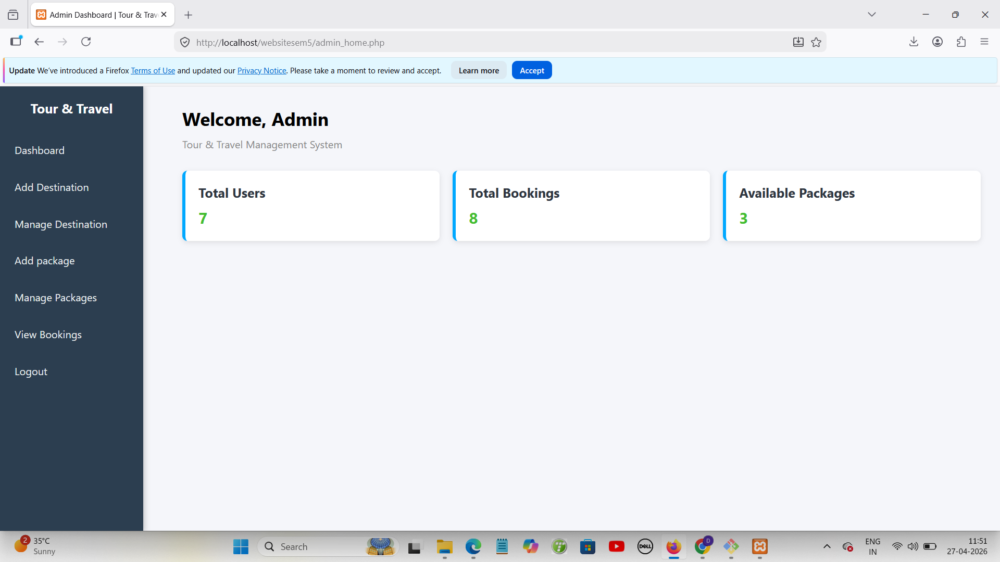
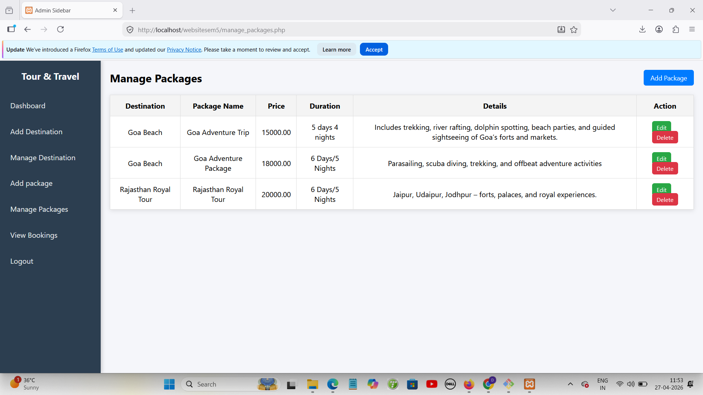
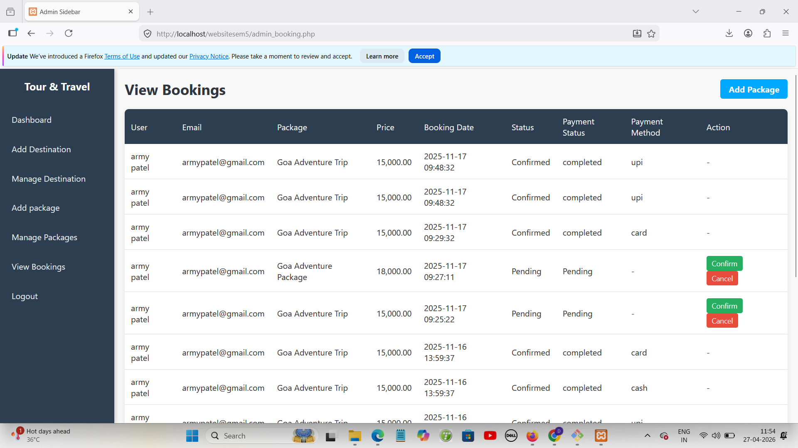
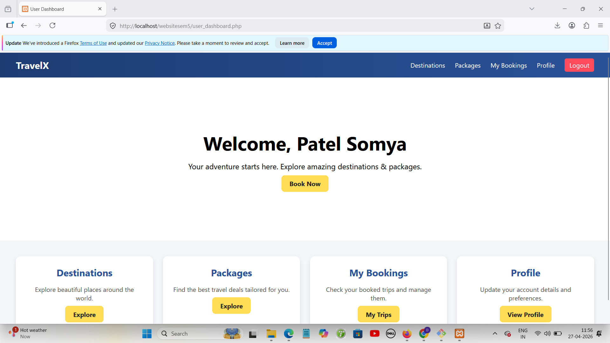
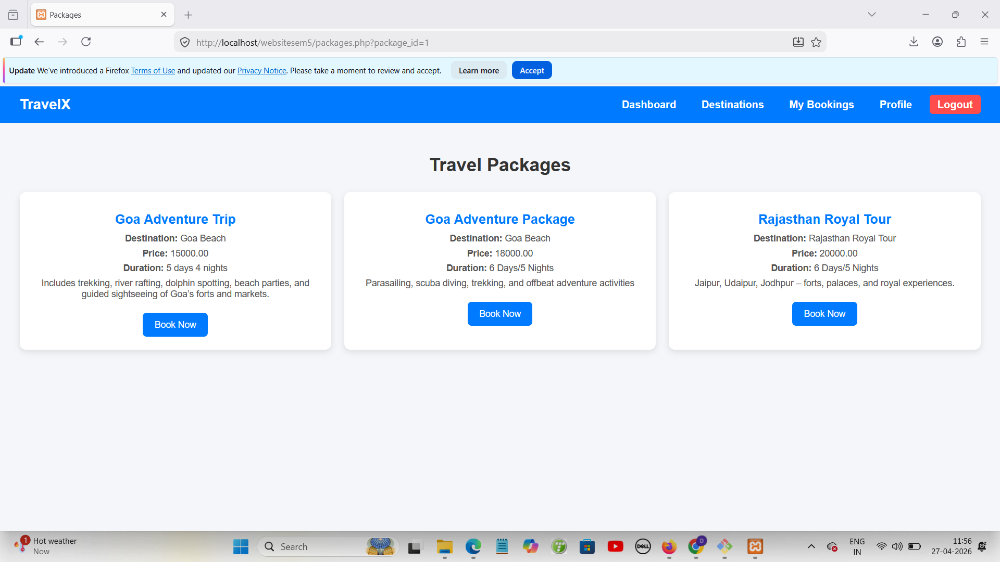

# 🌍 Tours and Travel Management System

## 🌐 Live Demo
🔗 https://dhyaniitours.infinityfreeapp.com

This project demonstrates full-stack web development using PHP, MySQL, HTML, CSS, and JavaScript with a fully deployed live application.

---

## 🚀 Features
- Browse available tour packages  
- Book tours with customer details  
- Store and manage booking data  
- Admin panel for managing tours and users   
- Database integration using MySQL  

---

## 🛠️ Tech Stack
- **Frontend:** HTML, CSS, JavaScript  
- **Backend:** PHP  
- **Database:** MySQL 

---

## 📂 Project Structure
tours-and-travel-management-system/
│── admin_home.php
│── connection.php
│── database.sql
│
├── css/
│ └── style.css
│
├── uploads/

---

## ⚙️ How to Run Locally

1. Install and open XAMPP  
2. Start Apache and MySQL  
3. Copy project folder to:
   C:\xampp\htdocs\  
4. Open phpMyAdmin:
   http://localhost/phpmyadmin  
5. Create a database (e.g., tours_travel_db)  
6. Import `database.sql`  
7. Run in browser:
   http://localhost/tours-and-travel-management-system  

---

## 🗄️ Database Configuration

Default settings:
- Host: localhost  
- Username: root  
- Password: (empty)  
- Database: tours_travel_db  

## 🔑 Admin Access
Admin panel:
https://dhyaniitours.infinityfreeapp.com/admin_login.php

---

## 📸 Screenshots

---

## 🚀 Future Improvements
- Payment gateway integration  
- Mobile responsive design  
- API integration for real-time travel data  

---

## 👤 Author
Dhyani Patel

---

## 📄 License
This project is for educational purposes only.
